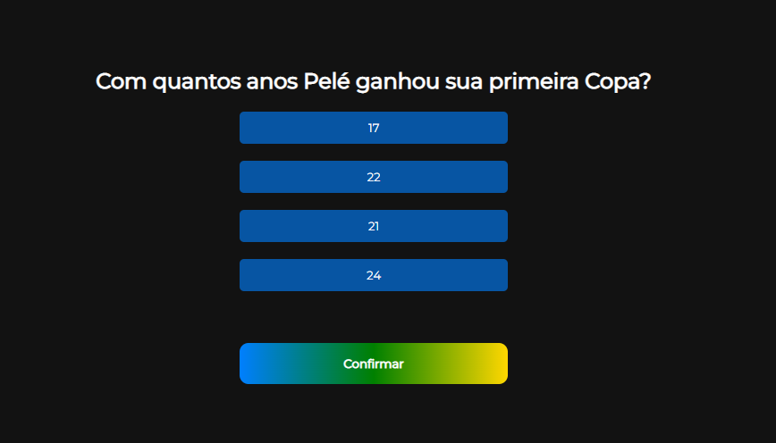

# Quiz
Um quiz criado com HTML, CSS, JavaScript e jQuery.
As perguntas e suas respostas são apresentadas aleatoriamente.
É temático da copa de 2022. Toca uma música ao errar uma questão e ao terminar o quiz.
Estava estudando como colocar sons nas páginas.

 

Por meio do link abaixo, você pode acessar a página postada:

<a href="https://gabrielarib.github.io/Quiz/" target="_blank">Link</a>
 

